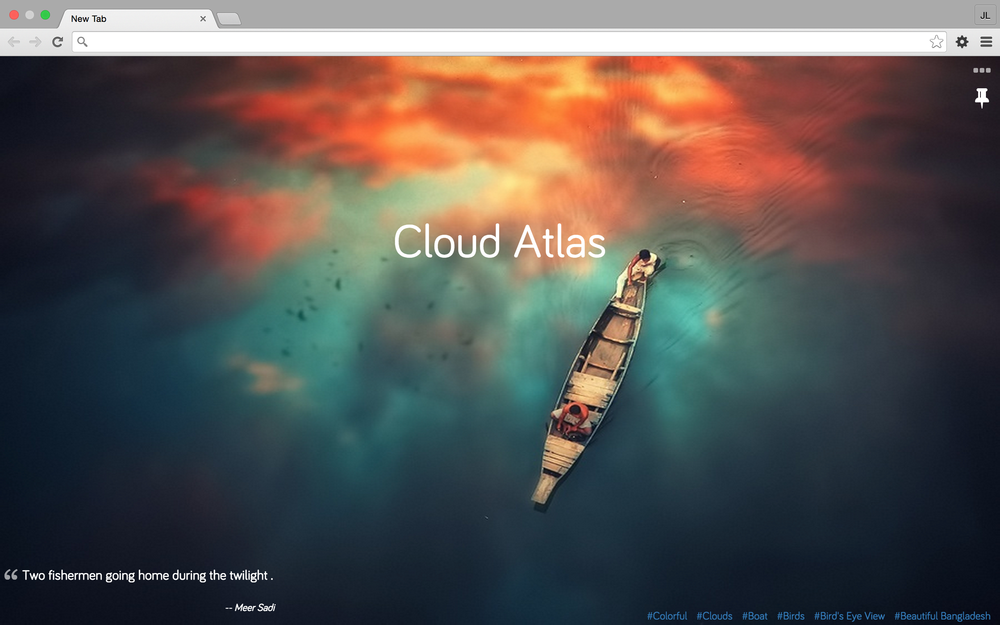
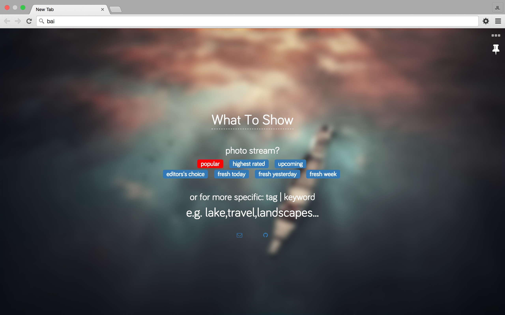

### Tabicture
> chrome new tab extension,custom new 500px pic for every new tab 

---

### Usage

- `git clone git@github.com:jl-/tabicture.git`
- `cd tabicture`
- `bower install`
- Open the URL chrome://extensions/ in your Chrome browser.
- Check the box for Developer Mode
- Click the button Load unpacked extension...
- Select the folder where you downloaded the repository,that is: tabicture
- The extension is now installed.

---

### Screen Shot

---

